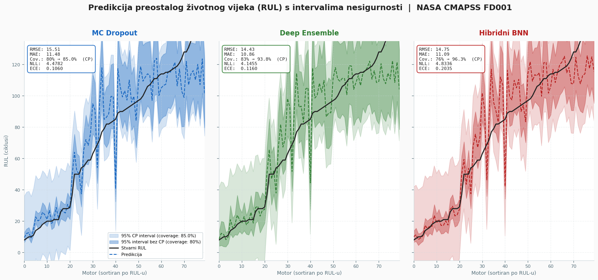

# Kvantifikacija nesigurnosti u modelima umjetne inteligencije: okvir za prediktivno održavanje i analizu rizika

> Ovaj repozitorij implementira UQ (Uncertainty Quantification) okvir za prediktivno održavanje industrijskih sistema, razvijen u sklopu BSc završnog rada na Elektrotehničkom fakultetu Univerziteta u Sarajevu.

> **Student:** Muhamed Džafić &nbsp;·&nbsp; Odsjek za računarstvo i informatiku, 2025/2026

## Motivacija

Deterministički modeli za prediktivno održavanje daju samo tačkaste predikcije:

> *"Motor će otkazati za 50 ciklusa."*

Za sigurnosno-kritične industrijske primjene to nije dovoljno. Inženjer koji donosi odluku o zaustavljanju postrojenja treba znati ne samo *šta* model predviđa, nego i *koliko je siguran* u tu predikciju.

Ovaj rad razvija okvir koji uz svaku predikciju daje i mjeru pouzdanosti:

> *"Preostali životni vijek: 50 ± 13 ciklusa (95% interval pouzdanosti)."*

---

## Problem i hipoteza

**Problem:** Deterministički modeli daju samo predikciju RUL-a (Remaining Useful Life) bez mjere pouzdanosti, što nije dovoljno za sigurnosne industrijske primjene.

**Hipoteza:** UQ metode (MC Dropout, Deep Ensemble, Hibridni BNN) mogu pružiti pouzdane intervale nesigurnosti za predikciju RUL-a, uz zadržavanje prediktivne tačnosti usporedive s determinističkim Baselineom, pri čemu Konformalna predikcija kao post-hoc tehnika može kalibrirati sve modele do statističke pouzdanosti od 95%.

---

## Dataset

**NASA CMAPSS FD001** — simulirani podaci rada mlaznih motora do otkaza.

- Senzorska mjerenja turbofan motora (21 senzorski kanal)
- Run-to-failure sekvence sa RUL oznakama
- Nakon EDA analize: uklonjeno **7 konstantnih senzora**, feature set reduciran sa **24 → 17 varijabli**
- RUL clipping na **125 ciklusa** (motor u ranim fazama ne pokazuje mjerljive znakove degradacije)

---

## Implementirane metode

Sve četiri metode dijele **identičnu LSTM osnovu** — arhitektura je kontrolirana varijabla, jedina razlika je UQ metoda.

| Metoda | Ulaz | Arhitektura | Izlaz |
|---|---|---|---|
| **Baseline LSTM** | 30 × 17 | LSTM(64) → Drop(0.3) → LSTM(32) → Drop(0.3) → Dense(32) | RUL |
| **MC Dropout** | 30 × 17 | Ista baza, Dropout **aktivan u inferenciji** (100×) | mean ± std |
| **Deep Ensemble** | 30 × 17 | 5 nezavisno treniranih instanci, ista baza | mean ± std |
| **Hibridni BNN** | 30 × 17 | LSTM slojevi deterministički, **DenseVariational** na Dense sloju (100×) | mean ± std |

### Konformalna predikcija

Implementirana kao **post-hoc kalibracijska tehnika** - kalibrira sve modele do ciljane statističke pouzdanosti od 95% bez ponovnog treniranja.

---

## Rezultati

### Tačnost i kalibracija (prije Konformalne predikcije)

| Model | RMSE | MAE | Coverage (95%) | Interval Width | NLL | ECE |
|---|---|---|---|---|---|---|
| Baseline LSTM | 15.56 | 11.59 | — | — | — | — |
| MC Dropout | 15.51 | 11.48 | 0.80 | 36.50 | 4.48 | 0.106 |
| Deep Ensemble | **14.43** | **10.86** | 0.83 | 34.59 | **4.15** | 0.116 |
| Hibridni BNN | 14.75 | 11.09 | 0.76 | **27.53** | 4.83 | 0.204 |

### Efekt Konformalne predikcije

| Model | Coverage (prije) | Coverage (poslije) | Width (prije) | Width (poslije) | q_hat |
|---|---|---|---|---|---|
| MC Dropout | 0.80 | 0.850 | 36.50 | 48.02 | 24.01 |
| Deep Ensemble | 0.83 | **0.938** | 34.59 | 57.41 | 28.71 |
| Hibridni BNN | 0.76 | **0.963** | 27.53 | 63.29 | 31.65 |

### Dekompozicija nesigurnosti

| Model | Aleatorička (std, ciklusi) | Epistemička (std, ciklusi) | Udio epistemičke |
|---|---|---|---|
| MC Dropout | 8.09 | 1.31 | 14.12% |
| Hibridni BNN | 5.66 | 1.42 | 20.22% |

Aleatorička komponenta (inherentni šum podataka) konzistentno dominira kroz cijeli raspon motora kod oba modela.

---

## Ključni nalaz

**Raskorak između tačnosti i kalibracije** je centralni nalaz rada:

- **Deep Ensemble** postiže najbolji RMSE (14.43) i najviši coverage (0.83) uz najniži NLL (4.15) i ECE (0.116) - ukupno najjači model po svim metrikama.
- **MC Dropout** nudi solidan coverage (0.80) i najniži ECE (0.106), ali uz najlošiju tačnost (RMSE = 15.51).
- **Hibridni BNN** pruža najuže intervale (27.53 ciklusa) kao kompromis između preciznosti i pouzdanosti.

> Za industrijsku primjenu, sama tačnost predikcije nije dovoljan kriterij odabira modela. Model koji griješi, ali zna da griješi, superioran je modelu koji griješi s lažnom sigurnošću.

---

## Metrike evaluacije

- **Coverage Probability** - udio stvarnih vrijednosti koje padaju unutar prediktivnog intervala
- **Mean Interval Width** - prosječna širina prediktivnog intervala (uži = precizniji)
- **Negative Log-Likelihood (NLL)** - mjeri kvalitet probabilističke kalibracije
- **Expected Calibration Error (ECE)** - mjeri odstupanje nominalne i opažene pokrivenosti

## Vizualizacija rezultata


---

## Struktura repozitorija

```
/code        Jupyter notebook s kompletnom implementacijom (EDA, trening, evaluacija)
/data        CMAPSS set podataka
/docs        Literatura i relevantni dokumenti
README.md    Opis projekta
```
